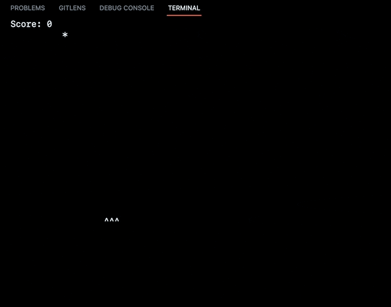

# 빗물 받기 게임

이 게임은 Rust와 ncurses를 사용하여 구현한 빗물 받기 게임입니다. 화면의 상단에서 떨어지는 빗물을 바구니로 받아서 스코어를 높이는 게임입니다.

## 요구사항

-  Rust 1.54 이상
-  ncurses 라이브러리

## 설치 및 실행 방법

1. Rust를 설치합니다. Rust 공식 홈페이지(https://www.rust-lang.org/)에서 설치 방법을 확인할 수 있습니다.
2. ncurses 라이브러리를 설치합니다. Ubuntu에서는 다음과 같이 설치할 수 있습니다.

   ```bash
   sudo apt-get install libncurses5-dev libncursesw5-dev
   ```

3. 이 저장소를 클론합니다.

   ```bash
   git clone https://github.com/raycast-ai/example-rust-ncurses-game.git
   ```

4. 저장소 디렉토리로 이동합니다.

   ```bash
   cd example-rust-ncurses-game
   ```

5. 게임을 실행합니다.

   ```bash
   cargo run
   ```

## 게임 규칙

1. 화면의 상단에서 떨어지는 빗물을 바구니로 받아서 스코어를 높입니다.
2. 바구니는 좌우 화살표 키를 사용하여 움직일 수 있습니다.
3. 빗물이 바닥에 닿으면 스코어가 1 감소합니다.
4. 스코어가 -10 이하가 되면 게임이 종료됩니다.

## 게임 화면
